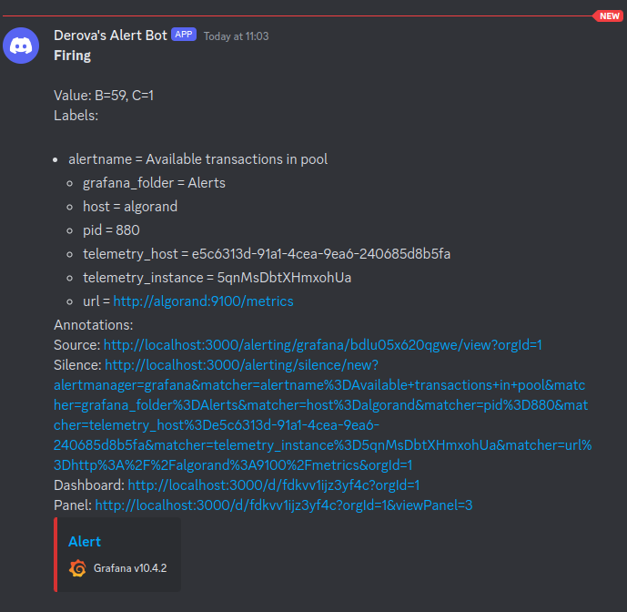

## Alerting Setup

Monitoring is a great start, but to keep ontop of issues as they occur it's important to have alerting configured so you can resolve the issues as promptly as posssible.

In the examples below, we're going to configure a simple alert - trigger if there are more than 100 txns in the pool.
This isn't an important metric to alert on for operations, but will assist in understanding how to setup alerts.

### Netdata Alerting

<Guide Here>

### InfluxDB Alerting

*Draft
In the left menu, select the Alerts
Threshold Check

Define Query:
Select your bucket, and find and select "algod_tx_pool_count" measurement. Select the gauge field. Change the Aggregate to Last.

Configure Check:
Schedule every 5s, Offset 0s
Critical above 100
Warning above 80
Tick

Name the check, "Transactions in pool over 100"

Move onto the notification endpoints and add your preferred notification method.
At the time of writing this is limited to HTTP, Slack or PagerDuty

Then move onto your notification rules.
You can set it to run every 5s when status is equal to Crit. Then alert to the channel you configured in the previous step

### Grafana Alerting

*Draft
In the left menu, select Alerting
We'll configure the contact points first, this is how / where you want to be notified.

Create a new contact point, in this example we'll use Discord
Enter the Discord webhook URL. You can obtain this from the channel settings menu of a server you manage (integrations, webhooks)

Setup optional titles / content, and if you want to use the Discord web hook name (I'd recommend this, otherwise it just says "Grafana")
Test the contact point and if successful, save your settings.

While in this section, go to Notification Templates and create a new template.*** Look into this

An easy way to setup alert rules is to go to your dashboard, find a panel containing a metric you want to be alerted on, and select the 3 dots when hovering over it, go to more then "New Alert Rule".
This will populate the query for us in the alert.

Give your alert a name, configure the thresholds you want per the query at the top. Example below:

If you click on preview, you can see a red line of your set point, and the current values from the query. This gives a rough idea of the alert conditions.

Add this to an Alerts folder, and create a new Evaluation Group (Eg: Group Name - 'Monitor every 10 seconds', Evaluation interval - '10s').
Configure the evaluation/polling times to your own needs if 10s is too quick.
Save the alert.

In the left hand menu under alerting, go to Notification policies and update the default policy to point to use your contact point.
You should now get alerts when the specified thresholds are met.

I've lowered the threshold to 30 to force it to alert, and this has come through.

When the condition is no longer met, a resolved alert will be sent.

### Allo Alerts

<Guide Here>

## Additional Resources

### Netdata
https://learn.netdata.cloud/docs/alerts-&-notifications/alert-configuration-reference

### InfluxDB
https://docs.influxdata.com/influxdb/v2/monitor-alert/

### Grafana
https://grafana.com/docs/grafana/latest/alerting/

### Allo Alerts
https://alerts.allo.info/
