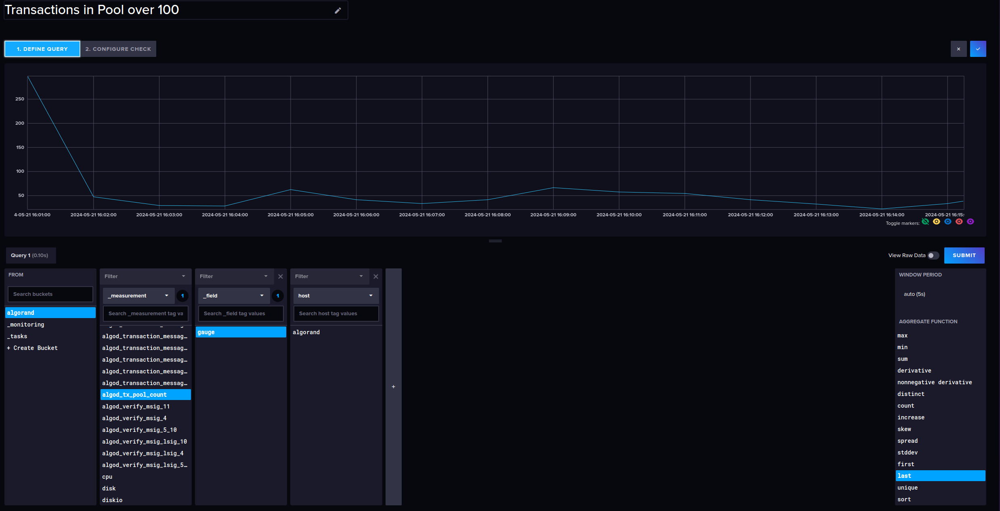
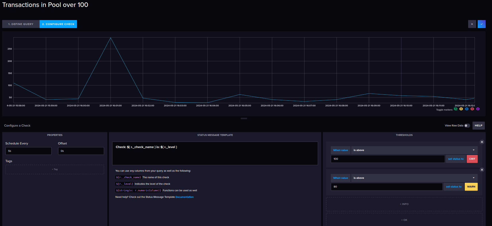
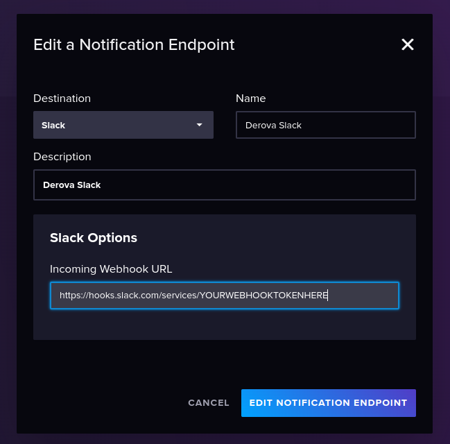
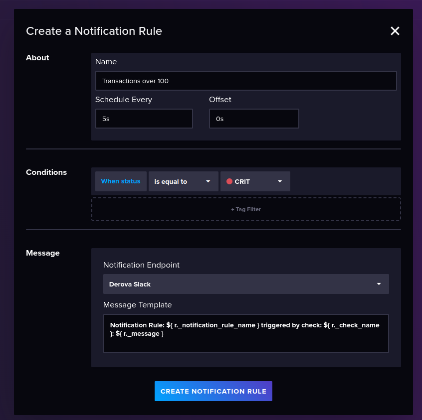
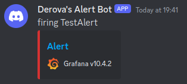
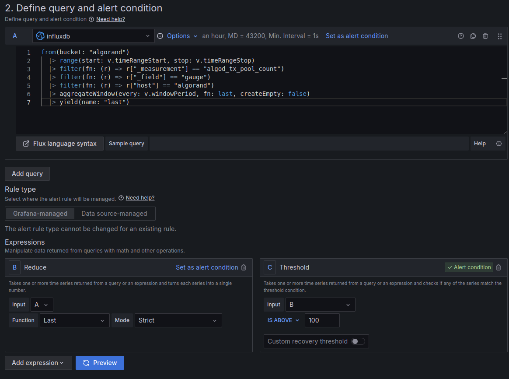
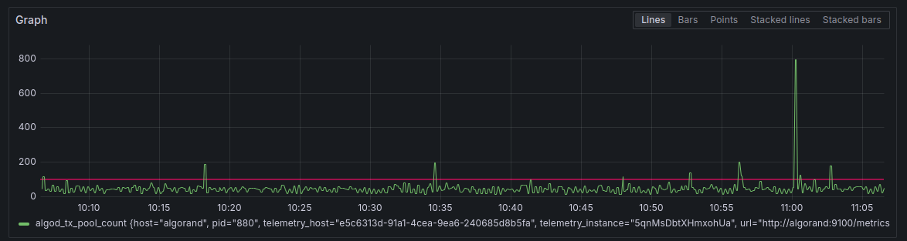
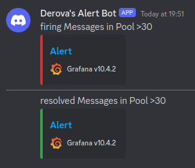

## Alerting Setup

Monitoring is a great start, but to keep ontop of issues as they occur it's important to have alerting configured so you can resolve the issues as promptly as posssible.

In the examples below, we're going to configure a simple alert - trigger if there are more than 100 txns in the pool.
This isn't an important metric to alert on for operations, but will assist with understanding how to setup alerts.

### Netdata Alerting

<TBC - Guide Here>

### InfluxDB Alerting

To get started with Alerting within InfluxDB, go to the alerting section under the main menu.

#### Threshold Check.

Define your query by selecting your bucket, find and select the measurement you want to be alerted on, in this example we're using the "algod_tx_pool_count" measurement.

We'll select the gauge field and change the aggregate type to 'Last'.

Name the check by clicking the pencil icon and call it something useful like "Transactions in pool over 100"



#### Configure Check

Here you specify your conditions, for example I'll schedule the check every 5s, with offset as 0s

- Critical above 100

- Warning above 80

Click on the tick at the top to save the checks.



#### Notification Endpoints

Under notification endpoints, add your preferred notification method.

At the time of writing this is limited to HTTP, Slack or PagerDuty



#### Notification Rules

You can set it to run every 5s when status is equal to Crit. Then alert to the channel you configured in the previous step



### Grafana Alerting

To get started with Alerting within Grafana, go to the alerting section under the main menu.

#### Contact Point

We'll configure the contact points first, this is how / where you want to be notified.

Create a new contact point, in this example we'll use Discord.

Enter the Discord webhook URL. You can obtain this from the channel settings menu of a server you manage (integrations, webhooks).

Setup optional titles / content, and if you want to use the Discord web hook name (I'd recommend this, otherwise it just says "Grafana").

To stop Grafana from sending a wall of text for an alert, I've put the following in the Message Content field.

```
{{range.Alerts -}}{{ .Status}} {{ .Labels.alertname }}{{end}}
```

Test the contact point and if successful, save your settings.



#### Alert Rules

An easy way to setup alert rules is to go to your dashboard, find a panel containing a metric you want to be alerted on, and select the 3 dots when hovering over it, go to more then "New Alert Rule".

This will populate the query for us in the alert.

Give your alert a name, configure the thresholds you want per the query at the top.



If you click on preview, you can see a red line of your set point, and the current values from the query. This gives a rough idea of the alert conditions.



Add this to an Alerts folder, and create a new Evaluation Group (Eg: Group Name - 'Monitor every 10 seconds', Evaluation interval - '10s').

Configure the evaluation/polling times to your own needs if 10s is too quick.

Save the alert.

#### Notification Policies

In the left hand menu under alerting, go to Notification policies and update the default policy to point to use your contact point.

You should now get alerts when the specified thresholds are met.

#### Example Alert

To force an alert while writing this guide, I lowered the threshold to 30 to force it to alert.

When the condition is no longer met, a resolved message will be sent per the examples below, where my rule name was "Messages in the Pool >30".



### Allo Alerts

<TBC - Guide Here>


## Additional Resources

### Netdata
https://learn.netdata.cloud/docs/alerts-&-notifications/alert-configuration-reference

### InfluxDB
https://docs.influxdata.com/influxdb/v2/monitor-alert/

### Grafana
https://grafana.com/docs/grafana/latest/alerting/

### Allo Alerts
https://alerts.allo.info/
