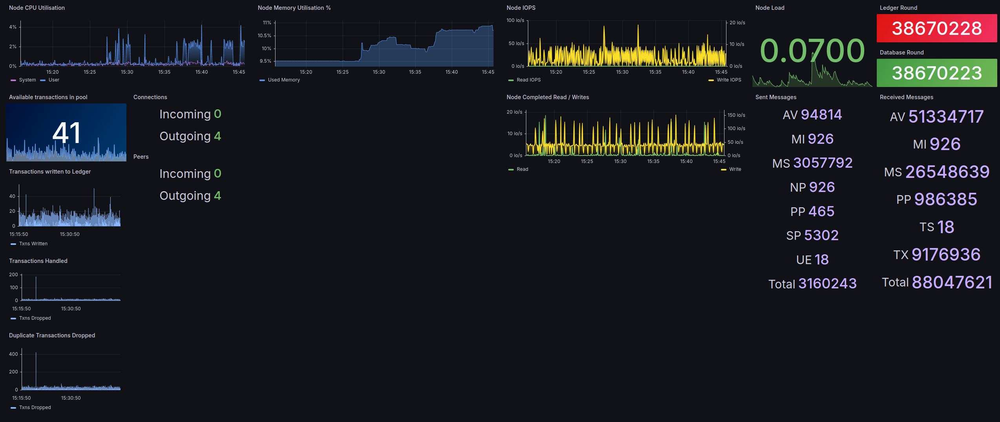

### InfluxDB / Telegraf / Grafana (by derova.algo)



It is recommended that you install InfluxDB and Grafana on a dedicated server that is separate to your Algorand node.
The Telegraf agent will need to be installed on your node so that it can monitor your Nodes System Metrics (CPU, RAM, Disk, Network).
If you only want to monitor the Algorand metrics, Telegraf can be installed on your Node or on your InfluxDB server.

#### InfluxDB (Database)

Install InfluxDB for your OS of choice by going to https://www.influxdata.com/downloads. In our example we'll install it for Ubuntu / Debian.

>wget -q https://repos.influxdata.com/influxdata-archive_compat.key

>echo '393e8779c89ac8d958f81f942f9ad7fb82a25e133faddaf92e15b16e6ac9ce4c influxdata-archive_compat.key' | sha256sum -c && cat influxdata-archive_compat.key | gpg --dearmor | sudo tee /etc/apt/trusted.gpg.d/influxdata-archive_compat.gpg > /dev/null

>echo 'deb [signed-by=/etc/apt/trusted.gpg.d/influxdata-archive_compat.gpg] https://repos.influxdata.com/debian stable main' | sudo tee /etc/apt/sources.list.d/influxdata.list

>sudo apt-get update && sudo apt-get install influxdb2


Once InfluxDB is installed on your system create a the config file that contains the following information

>sudo nano /etc/influxdb/influxdb.conf

```
[meta]
  dir = "/var/lib/influxdb/meta"

[data]
  dir = "/var/lib/influxdb/data"
  wal-dir = "/var/lib/influxdb/wal"
  series-id-set-cache-size = 100

[http]
   bind-address = ":8086"
```

Start the Influxd service.
>sudo systemctl start influxd

Verify you can access the web interface by going to *`http://Your_Influx_Server_IP:8086`*.

You should see a `Get Started` button, which will guide you through setting up the InfluxDB instance.

Setup your `Username`, `Password`, `Organisation Name`, and `Bucket Name`.
Record this information somewhere safe as we'll need this later.

Once the account is setup, the next screen will display an `API Token`.
Copy this token by clicking on `Copy to Clipboard` or if you're like me and that button doesn't work, manually select and copy the Token on the screen and save it with the other information recorded.

Select `Configure Later` and you'll see the default InfluxDB web interface.
Minimise this window as we'll come back to it shortly.

#### Telegraf (Poller)

Install Telegraf for your OS of choice by going to https://www.influxdata.com/downloads. As above, we'll install it for Ubuntu / Debian.
We're installing this onto our Algorand Node so that we can monitor the system metrics too, so we'll need to add the keys to this server.

> wget -q https://repos.influxdata.com/influxdata-archive_compat.key

> echo '393e8779c89ac8d958f81f942f9ad7fb82a25e133faddaf92e15b16e6ac9ce4c influxdata-archive_compat.key' | sha256sum -c && cat influxdata-archive_compat.key | gpg --dearmor | sudo tee /etc/apt/trusted.gpg.d/influxdata-archive_compat.gpg > /dev/null

> echo 'deb [signed-by=/etc/apt/trusted.gpg.d/influxdata-archive_compat.gpg] https://repos.influxdata.com/debian stable main' | sudo tee /etc/apt/sources.list.d/influxdata.list

> sudo apt-get update && sudo apt-get install telegraf

Edit the Telegraf configuration file

>sudo nano /etc/telegraf/telegraf.conf

Locate the `OUTPUT PLUGINS`section, and enable `outputs.influxdb_v2` by uncommenting the following lines and adding your information as recorded in the previous steps.

*In nano you can search using `Ctrl + w` , entering your search term and pressing enter. For example use `outputs.influxdb_v2` to find the section required. As this is a rather large file this may come in handy.*

```
[[outputs.influxdb_v2]]

urls = ["http://Your_Influx_Server_IP:8086"]

token = "Insert_API_Key_Here"

organization = "Insert_Organisation"

bucket = "Insert_Bucket"
```

Locate the `INPUT PLUGINS` section (serch for `inputs.cpu` which should take you to the top of the inputs section) and add the Prometheus plugin configuration with the URL pointing to your Algorand Node IP/Hostname.
You can enter your Node IP or just "127.0.0.1" / "localhost" as the Telegraf agent is on the same server.

>[[inputs.prometheus]]

>  urls = ["http://Your_Node_IP:9100/metrics"]

Restart the Telegraf Service

>sudo systemctl restart telegraf.service

Verify the data is being scraped and recorded by going to your InfluxDB Web Interface (*`http://Your_Influx_Server_IP:8086`*) and clicking on `Data Explorer` in the menu.

You should see a `query` field with a `from` column.
Select your bucket name, and in the `filter` column, you'll see your node metrics under the `_measurement` filter.

By default, Telegraf polls every 10 seconds. You can adjust this meet your requirements by editing the `interval` under the `agent` section in the Telegraf configuration.

From here, you can build your own queries, dashboards and alerts.

If you get stuck you can reference their documentation https://docs.influxdata.com/

Or you can continue on and setup Grafana for your graphing / dashboard needs if you prefer.

#### Grafana (Graphing Frontend)

Install Grafana for your OS of choice by going to https://grafana.com/grafana/download.
It is recommended to install this on the same dedicated server as your InfluxDB instance.
As above, we'll install it for Ubuntu / Debian.

>sudo apt-get install -y adduser libfontconfig1 musl

>wget https://dl.grafana.com/oss/release/grafana_10.4.2_amd64.deb

>sudo dpkg -i grafana_10.4.2_amd64.deb

Once Grafana is installed, reload the Daemon, Enable and Start the service.

>sudo /bin/systemctl daemon-reload

>sudo /bin/systemctl enable grafana-server

>sudo /bin/systemctl start grafana-server


With the service running, you can now browse to your Grafana interface which is listening on port 3000.

*`http://Your_Influx_Server_IP:3000`*

The default credentials are `admin/admin`, once you've logged in change the password as prompted.

In the left and menu, select `Connections` and search for `InfluxDB`.
Click on `Add new data source`.

Change the `Query Language` from `InfluxQL` to `Flux`.

Enter the URL `http://localhost:8086`
Disable `Basic Auth`
Enter your `Organisation`, `API Token` and `Bucket` in the InfluxDB setion.

Click on `Save and Test`, you should see a green bar saying datasource is working.
You can then go back to the Grafana menu and start building a dashboard.

If you're unfamiliar with Flux language, you can build your quieries in the InfluxDB webGUI using the `Query Builder` by selecting your metrics and time periods. When you want to graph it in Grafana, select `Script Editor` and copy the query to a new Grafana Panel.

Here is my example query that is showing the current `Ledger Round`, where my bucket is called `algorand`.
```
from(bucket: "algorand")
  |> range(start: v.timeRangeStart, stop: v.timeRangeStop)
  |> filter(fn: (r) => r["_measurement"] == "algod_ledger_round")
  |> filter(fn: (r) => r["_field"] == "gauge")
  |> aggregateWindow(every: 10s, fn: last, createEmpty: false)
  |> yield(name: "last")
```
