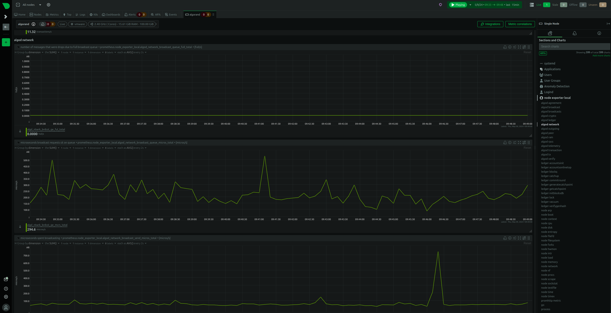

### Netdata Cloud (by SilentRhetoric)



#### Install Netdata
Register an account at https://www.netdata.cloud/

In the cloud dashboard, go to the `Nodes` tab and click the `Add nodes` button.  There is a wizard that will build the one-liner command to install and configure Netdata for your system and hook it up to the cloud account you just created.

#### Configuring Netdata for Prometheus Endpoint Monitoring

https://www.netdata.cloud/prometheus-monitoring/

Edit the `go.d/prometheus.conf` configuration file using `edit-config` from the Netdata config directory, which is typically at `/etc/netdata`.

Change your working directory to the netdata directory
>cd /etc/netdata 

*Replace with your Netdata config directory if this is different*

Edit the file
>sudo ./edit-config go.d/prometheus.conf

Here is an example for the port that the node uses by default for metrics, this may already be near the top of the file commented out and you can just uncomment these lines:

```
jobs:
  - name: node_exporter_local
    url: http://127.0.0.1:9100/metrics
````

Once the prometheus exporter is configured, update your Netdata agent configuration to allow global exporting to the console.

>nano /etc/netdata/exporting.conf

Update the following to yes.
```
[exporting:global]
    enabled = yes
```


Then, restart Netdata with
>systemctl restart netdata.

You should now be able to visit `app.netdata.cloud` to see your Algorand node's metrics in a section of charts called "node exporter local" to see live and historical time series graphs of all the metrics the node is publishing.
